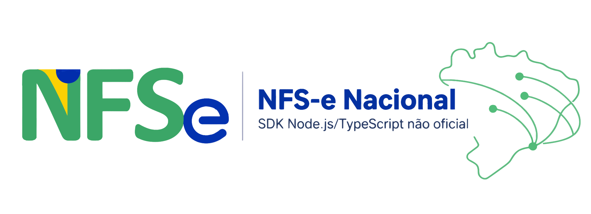

# nfse-node



SDK não oficial em Node.js/TypeScript para integração com a NFS-e Nacional (ADN/SEFIN Nacional).

Não há vínculo com a Secretaria-Executiva do Comitê Gestor da NFS-e (SE/CGNFS-e), com a Receita Federal ou com qualquer prefeitura. É um projeto independente, mantido pela comunidade.

## Status

Em desenvolvimento inicial. A tabela abaixo reflete o estado real de cada módulo - nada aqui é usado em produção ainda.

| Módulo | Descrição | Status |
| --- | --- | --- |
| `certificado` | Leitura de certificado A1 (.pfx/.p12) | Feito |
| `assinatura` | Assinatura XML (XMLDSig) | Feito |
| `dps` | Tipos e serialização da DPS, incluindo o bloco IBSCBS (XML validado contra o XSD oficial) | Feito; grupo gReeRepRes (reembolso/repasse/ressarcimento de terceiros) ainda não |
| `cliente` | Cliente HTTP mTLS para o SEFIN Nacional (produção e homologação) | Feito; endpoints do ADN (DFe, parametrização) ainda não |
| `danfse` | Geração do DANFSe em PDF (NT 008/2026) | Feito; canhoto e dedução por documento ficam pra depois |

## Por que este projeto existe

Já existem SDKs Node.js para a NFS-e Nacional cobrindo certificado, assinatura e comunicação com a SEFIN. O que nenhum deles cobre até agora:

- **Geração do DANFSe em PDF**, no leiaute novo (NT 008/2026). Isso deixou de ser um detalhe secundário desde que a API oficial de geração de DANFSe (`adn.nfse.gov.br/danfse/docs`) foi desativada em 03/08/2026: qualquer sistema de emissão passou a precisar gerar esse documento localmente.
- **Suporte completo a IBS/CBS** (bloco `IBSCBS` da reforma tributária), além do shape legado de tributação municipal.

O restante do SDK (certificado, assinatura, cliente HTTP) existe porque é pré-requisito pra chegar nesses dois pontos, não porque faltava alternativa - e é construído do zero a partir das especificações oficiais, não copiado de nenhum outro projeto.

## Créditos

- [nfse-nacional/nfse-php](https://github.com/nfse-nacional/nfse-php): usado como referência de escopo e organização.
- [Nota Técnica nº 008 (DANFSe)](https://www.gov.br/nfse/pt-br/biblioteca/documentacao-tecnica/rtc/nt-008-se-cgnfse-danfse-20260714-v1-02.pdf): especificação oficial usada como fonte do leiaute do DANFSe.
- [Esquemas XSD da NFS-e Nacional](https://www.gov.br/nfse/pt-br/biblioteca/documentacao-tecnica/documentacao-atual/nfse-esquemas_xsd-v1-01-20260209.zip): baixados direto do gov.br e versionados em [`schemas/nfse/v1.01`](schemas/nfse/v1.01) - fonte de verdade dos tipos e da serialização da DPS, e usados nos testes pra validar o XML gerado contra o schema oficial.
- [Liberation Sans](https://github.com/liberationfonts/liberation-fonts) e [DejaVu Sans](https://dejavu-fonts.github.io/): fontes livres embutidas no gerador de DANFSe (substitutas de Arial e Microsoft Sans Serif, que são proprietárias e não podem ser redistribuídas). Licenças em [`assets/fonts`](assets/fonts).

## Especificações

<details>
<summary>Detalhes</summary>

- NFS-e Nacional - Esquemas XML v1.01 - [gov.br/nfse](https://www.gov.br/nfse/pt-br/biblioteca/documentacao-tecnica/documentacao-atual/nfse-esquemas_xsd-v1-01-20260209.zip)
- DANFSe - Nota Técnica nº 008, versão 1.02 - [gov.br/nfse](https://www.gov.br/nfse/pt-br/biblioteca/documentacao-tecnica/rtc/nt-008-se-cgnfse-danfse-20260714-v1-02.pdf)
- XML Signature (XMLDSig) - [W3C](https://www.w3.org/TR/xmldsig-core1/), conforme exigido pelo contrato da DPS

</details>

## Instalação

```
npm install nfse-node
```

## Licença

Apache License 2.0. Veja [LICENSE](LICENSE) e [NOTICE](NOTICE).

## Contribuindo

Issues e pull requests são bem-vindos. Veja o [Código de Conduta](CODE_OF_CONDUCT.md) e a [Política de Segurança](SECURITY.md) antes de contribuir. O idioma do projeto (código, mensagens de erro, documentação) é português.

<a href="https://github.com/invoyx/nfse-node/graphs/contributors">
  
</a>
